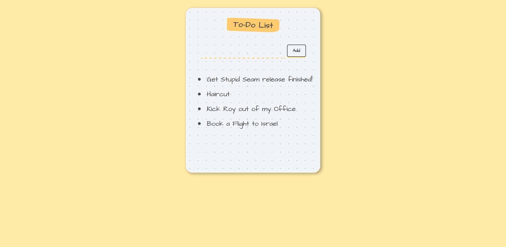

# ToDoList App with ReactJS

A ToDoList App where I was able to add some new items by clicking the add button i.e. create a list of items with bullet points with the functionality to remove them too. 
Through this app, I dived deep into some of the fundamental concepts of ReactJS like working with components, React hooks, states, event handling in react, working with and managing the component tree.  

## Author
> Nishkarsh01

## Screenshots

## Live Demo 
[ToDoList App](https://todolistwithreactjs.herokuapp.com/)

## Developed using
* Html
* css
* javascript
* ReactJS
